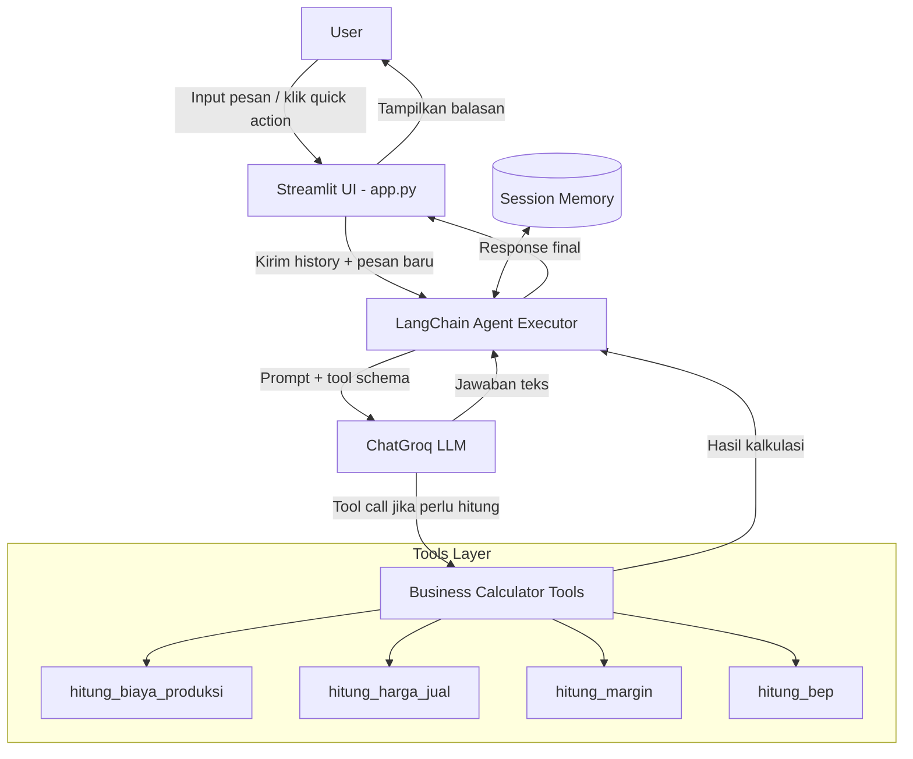
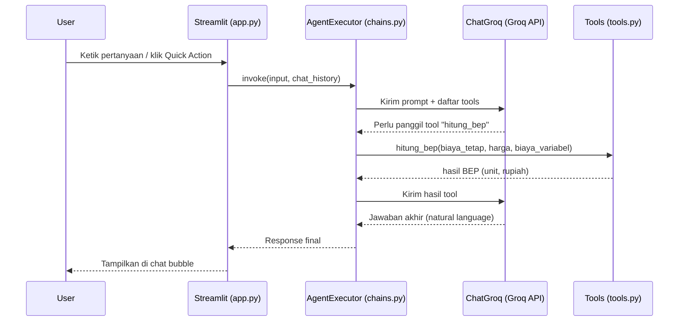

# PRD — Yele: AI Business Planning Assistant

## 1. Ringkasan Produk

**Yele** adalah chatbot berbasis LLM yang membantu masyarakat (khususnya calon
pengusaha UMKM) untuk merencanakan, mendirikan, dan menjalankan bisnis. Fokus
utama Yele adalah membantu perhitungan bisnis praktis: biaya produksi, harga
jual, margin keuntungan, dan titik impas (Break Even Point / BEP), sekaligus
memberi saran strategis dalam bentuk percakapan natural.

- **Nama produk:** Yele
- **LLM Provider:** Groq (via API Key)
- **Orkestrasi LLM:** LangChain
- **UI:** Streamlit
- **Bahasa:** Bahasa Indonesia (default), bisa multibahasa

## 2. Tujuan (Objectives)

1. Memberi akses gratis/murah ke konsultan bisnis AI untuk masyarakat umum.
2. Menyediakan tools kalkulasi bisnis yang akurat (bukan sekadar estimasi LLM).
3. Membantu user menyusun rencana bisnis sederhana (business plan) langkah
   demi langkah melalui percakapan.
4. Menjadi starter-kit yang mudah dikembangkan (modular, tools bisa ditambah).

## 3. Target Pengguna

- Calon pengusaha / UMKM pemula
- Pelaku usaha rumahan (kuliner, kerajinan, jasa)
- Mahasiswa/pelajar yang belajar kewirausahaan
- Konsultan bisnis kecil yang butuh alat bantu cepat

## 4. Fitur Utama

### 4.1 Chat Konsultasi Bisnis (Core)
- Percakapan bebas seputar ide bisnis, strategi, legalitas usaha, marketing,
  dsb.
- Memori percakapan (conversation memory) agar konteks tidak hilang.

### 4.2 Business Calculator Tools (LangChain Tools)
Dipanggil otomatis oleh LLM (tool calling) saat user menyebutkan kebutuhan
hitung-hitungan, atau lewat tombol cepat di sidebar:

| Tool | Fungsi | Input | Output |
|---|---|---|---|
| `hitung_biaya_produksi` | Hitung total & biaya produksi per unit | bahan baku, tenaga kerja, overhead, jumlah unit | biaya total & per unit |
| `hitung_harga_jual` | Rekomendasi harga jual dari target margin | biaya produksi/unit, target margin % | harga jual disarankan |
| `hitung_margin` | Hitung margin keuntungan | harga jual, biaya produksi | margin % dan margin Rp |
| `hitung_bep` | Hitung Break Even Point | biaya tetap, harga jual/unit, biaya variabel/unit | BEP unit & BEP rupiah |

### 4.3 Quick Actions (Sidebar)
Tombol pintas yang otomatis mengisi prompt template ke chat (misal: "Hitung
BEP usaha saya").

### 4.4 Pengaturan
- Input Groq API Key (jika belum di-set via `.env`)
- Pilihan model Groq (mis. `llama-3.3-70b-versatile`, `llama-3.1-8b-instant`)
- Tombol reset percakapan

## 5. Tech Stack

| Layer | Teknologi |
|---|---|
| UI | Streamlit |
| LLM Orchestration | LangChain (`langchain`, `langchain-groq`) |
| LLM Provider | Groq API (`ChatGroq`) |
| Tools | LangChain `@tool` custom functions (Python) |
| Memory | `ConversationBufferMemory` / `st.session_state` |
| Config | `python-dotenv` |

## 6. Arsitektur Sistem



### Sequence: Alur Satu Pesan dengan Tool Calling



## 7. Implementation Plan

| Fase | Deliverable | Detail |
|---|---|---|
| **Fase 0 — Setup** | Struktur project, `.env`, `requirements.txt` | Siapkan repo, virtualenv, Groq API key |
| **Fase 1 — Core Chat MVP** | `app.py` dasar + `chains.py` | Chat sederhana Streamlit ↔ ChatGroq tanpa tools |
| **Fase 2 — Business Tools** | `tools.py` | Implementasi 4 tool kalkulasi bisnis + unit test manual |
| **Fase 3 — Agent + Tool Calling** | Integrasi agent | Gabungkan tools ke agent (`create_tool_calling_agent`) |
| **Fase 4 — Memory & UX** | Session memory, sidebar, quick actions | Riwayat chat persist, tombol reset, quick prompt |
| **Fase 5 — Polish & Guardrail** | Prompt system Yele, error handling | System prompt persona "Yele", validasi input angka, handling API error |
| **Fase 6 — Testing** | Skenario uji | Uji tools dengan berbagai kasus (biaya 0, margin negatif, dll) |
| **Fase 7 — Deployment (opsional)** | Streamlit Community Cloud / server sendiri | Set `GROQ_API_KEY` sebagai secret |

## 8. ASCII Wireframe

```
┌─────────────────────────────────────────────────────────────────────┐
│  YELE — Asisten Perencanaan Bisnis AI                          ⚙️    │
├───────────────────────────┬───────────────────────────────────────-┤
│ SIDEBAR                   │  CHAT AREA                              │
│                           │                                         │
│ 🔑 Groq API Key           │  ┌───────────────────────────────────┐  │
│ [ ********************* ] │  │ 🤖 Yele: Halo! Aku Yele, siap      │  │
│                           │  │ bantu rencanain bisnismu. Mau      │  │
│ 🧠 Pilih Model            │  │ mulai dari mana?                   │  │
│ [ llama-3.3-70b-versatile]│  └───────────────────────────────────┘  │
│                           │                                         │
│ ── Quick Actions ──       │        ┌─────────────────────────────┐  │
│ [ Hitung Biaya Produksi ] │        │ 🧑 User: Modal bahan baku    │  │
│ [ Hitung Harga Jual    ]  │        │ 2jt, tenaga kerja 1jt,       │  │
│ [ Hitung Margin        ]  │        │ overhead 500rb, 100 unit.    │  │
│ [ Hitung BEP           ]  │        │ Berapa biaya per unit?       │  │
│                           │        └─────────────────────────────┘  │
│ ── Riwayat ──             │                                         │
│ • Sesi hari ini           │  ┌───────────────────────────────────┐  │
│                           │  │ 🤖 Yele: Biaya produksi per unit   │  │
│ [ 🔄 Reset Percakapan ]   │  │ kamu adalah Rp 35.000. Mau aku     │  │
│                           │  │ bantu hitung harga jual & margin? │  │
│                           │  └───────────────────────────────────┘  │
│                           │                                         │
│                           │  ┌───────────────────────────────────┐  │
│                           │  │  💬 Ketik pesan...          [Kirim] │  │
│                           │  └───────────────────────────────────┘  │
└───────────────────────────┴─────────────────────────────────────────┘
```

## 9. Non-Functional Requirements

- **Keamanan:** API key tidak pernah ditampilkan/log ke pihak ketiga; disimpan
  di `.env` atau `st.session_state` (masked input).
- **Reliabilitas:** Tangani error Groq API (rate limit, timeout) dengan pesan
  ramah, bukan stack trace mentah.
- **Akurasi kalkulasi:** Semua hitungan angka dilakukan oleh fungsi Python
  deterministik (tools), bukan diserahkan ke LLM, agar hasil selalu presisi.
- **Skalabilitas kode:** Tools baru bisa ditambahkan tanpa mengubah struktur
  agent (cukup daftarkan di `tools.py` & list `ALL_TOOLS`).

## 10. Pengembangan Selanjutnya (Future Work)

- Ekspor rencana bisnis ke PDF/Word.
- Tool tambahan: proyeksi cash flow, kalkulasi pajak UMKM, analisis kompetitor.
- Integrasi RAG untuk regulasi UMKM terbaru (dari sumber resmi pemerintah).
- Multi-user dengan penyimpanan riwayat permanen (database).
